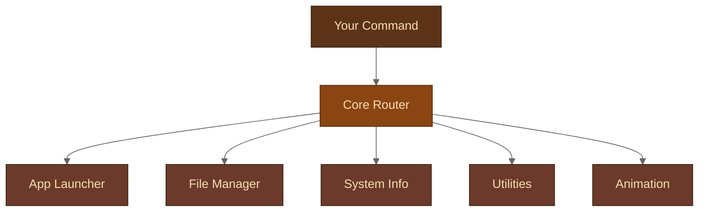

<div align="center">


<br/>


</div>

---

> *"This town ain't big enough for slow workflows and broken terminals."*

---

## ══ WANTED ══

```
┌─────────────────────────────────────────────────────────────┐
│                                                             │
│   W A N T E D                                               │
│   ▔▔▔▔▔▔▔▔▔▔▔▔▔▔▔▔▔▔▔▔▔▔▔▔▔▔▔▔▔▔▔▔▔▔▔▔▔▔▔▔▔               │
│   A terminal that works hard, asks no questions,            │
│   needs no internet, and gets the job done by sundown.      │
│                                                             │
│   REWARD: A faster, cleaner workflow. Dead or alive.        │
│                                                             │
└─────────────────────────────────────────────────────────────┘
```

**Terminal Assistant** is a no-nonsense, modular, Python-powered CLI tool built to run entirely on your machine. No cloud. No API keys. No nonsense. Just raw local power.

---

## ══ THE ARSENAL ══

```
  ┌──────────────────┬─────────────────────────────────────────────┐
  │  MODULE          │  WHAT IT DOES                               │
  ├──────────────────┼─────────────────────────────────────────────┤
  │  App Launcher    │  Fire up Notepad, Browser, Paint & more     │
  │  File Manager    │  Create, delete, list & search the frontier │
  │  System Info     │  CPU, memory & disk — straight talk         │
  │  Utilities       │  Calculator + countdown timer               │
  │  Animated Clock  │  A digital timepiece for the command line   │
  └──────────────────┴─────────────────────────────────────────────┘
```

---

## ══ HOW IT'S WIRED ══



---

## ══ RIDE INTO TOWN — SETUP GUIDE ══

> Before you saddle up, make sure your rig is ready.

**What you need:**

- Python 3.8 or higher → [python.org/downloads](https://www.python.org/downloads/)
- pip (ships with Python)
- Git → [git-scm.com/downloads](https://git-scm.com/downloads)
- Windows OS

Check your Python with:
```
python --version
```

---

### Step I — Claim Your Territory

```bash
git clone https://github.com/kushalchalla981-tech/terminalAssistant.git
cd terminalAssistant
cd "term ass1"
```

> The inner folder has a space in its name — keep those quotes on.

---

### Step II — Stock the Saddlebag

```bash
pip install -r requirements.txt
```

Installs `psutil` for system monitoring. Quick and painless.

> If `pip` gives you trouble, try `pip3 install -r requirements.txt`

---

### Step III — Draw

```bash
python main.py
```

The assistant boots up. You're in business.

> If `python` gives you trouble, try `python3 main.py`

---

## ══ THE CODEX — COMMAND REFERENCE ══

```
  ┌────────────────────┬──────────────────────────┬──────────────────────────┐
  │  TASK              │  SYNTAX                  │  EXAMPLE                 │
  ├────────────────────┼──────────────────────────┼──────────────────────────┤
  │  Open App          │  open <app>              │  open notepad            │
  │  Create File       │  create file <n>         │  create file notes.txt   │
  │  Create Folder     │  create folder <n>       │  create folder work      │
  │  Delete File       │  delete file <n>         │  delete file old.txt     │
  │  Delete Folder     │  delete folder <n>       │  delete folder old       │
  │  List Directory    │  list                    │  list                    │
  │  Search File       │  search <filename>       │  search resume.pdf       │
  │  System Info       │  sysinfo                 │  sysinfo                 │
  │  Timer             │  timer <seconds>         │  timer 60                │
  │  Calculator        │  calc <expression>       │  calc (10 + 5) * 2       │
  │  Animated Clock    │  time                    │  time                    │
  │  Clear Screen      │  clear                   │  clear                   │
  │  Exit              │  exit                    │  exit                    │
  └────────────────────┴──────────────────────────┴──────────────────────────┘
```

---

## ══ COLOR CODE OF THE WEST ══

The terminal speaks in three tongues:

```
  GREEN  ──  Job done. Ride on.
  RED    ──  Something went sideways. Check your inputs.
  CYAN   ──  Intel. Read it.
  YELLOW ──  A highlight worth your attention.
```

---

## ══ THE LAY OF THE LAND ══

```
  terminalAssistant/
  └── term ass1/
      ├── main.py            ← Start here. Always.
      ├── requirements.txt   ← One dependency: psutil
      ├── README.md          ← You are here
      ├── assets/
      │   └── banner.svg     ← The sign above the door
      └── commands/
          ├── app_launcher.py
          ├── file_manager.py
          ├── sys_info.py
          ├── utilities.py
          └── animation.py
```

---

## ══ TRAIL WISDOM ══

- Run `sysinfo` when the machine feels sluggish — know what's eating your resources
- Chain `timer 25` and `timer 5` for a clean work-rest rhythm
- `clear` early, `clear` often — a clean screen keeps your head clear

---

```
  ════════════════════════════════════════════════════════════
   Built local. Runs hard. Asks nothing of the cloud.

                                       — Terminal Assistant
  ════════════════════════════════════════════════════════════
```
