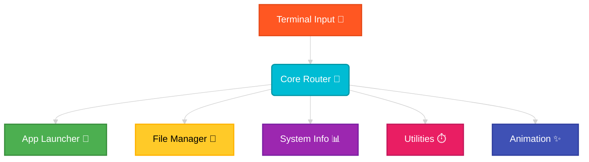

# 🚀 Terminal Assistant 💻✨

Welcome to the **Terminal Assistant**! Your personal, local command-line companion — now with **extra purr-ower** 🐾


---

```
   /\_____/\
  /  o   o  \      "You called? I heard keyboard clicks."
 ( ==  ^  == )
  )         (      🐱 Terminal Cat — guarding your CLI since 2024
 (           )
  \  |   |  /
 /_`|   |'_\
```

---

## 🌟 What is this?

Terminal Assistant is a **sleek, modular, Python-powered CLI assistant** that lives entirely on your computer!

> 🐾 *No APIs. No internet. No drama. Just pure, local cat-powered processing.*

**Zero APIs. Zero internet required.** Just raw, local processing power to help you speed through your daily tasks!



---

## 🛠️ Features

| ✨ Feature | 🐾 What it Does |
|---|---|
| 🚀 **App Launcher** | Instantly fire up Notepad, Calculator, Paint, the Browser, and more! |
| 📁 **File Manager** | Create, delete, list, and recursively search files and folders |
| 📊 **System Info** | A colorful mini-Task Manager right in your terminal (CPU, Memory, Disk) |
| ⏱️ **Utilities** | Handy calculator + visual countdown timer! |
| 🕐 **Animated Clock** | A flashy digital clock for your command line! |

---

## 🚀 Getting Started

> *The cat is ready. Are you?* 🐱

**Step 1 — Clone the repo:**
```bash
git clone https://github.com/kushalchalla981-tech/terminalAssistant.git
cd "term ass1"
```

**Step 2 — Install dependencies:**
```bash
pip install -r requirements.txt
```

**Step 3 — Unleash the assistant:**
```bash
python main.py
```

```
   |\      _,,,---,,_
   /,`.-'`'    -.  ;-;;,_
  |,4-  ) )-,_..;\ (  `'-'
 '---''(_/--'  `-'\_)

  ✅ Installation complete. Cat approves.
```

---

## ⌨️ Command Cheat Sheet

Here's every trick up this assistant's sleeve (and paw 🐾):

| 🟢 Task | ⌨️ Command Syntax | 📝 Example |
| :--- | :--- | :--- |
| **Open Application** | `open <app_name>` | `open notepad` or `open browser` |
| **Create File** | `create file <n>` | `create file notes.txt` |
| **Create Folder** | `create folder <n>` | `create folder projects` |
| **Delete File** | `delete file <n>` | `delete file old_notes.txt` |
| **Delete Folder** | `delete folder <n>` | `delete folder old_projects` |
| **List Directory** | `list` | `list` |
| **Search File** | `search <filename>` | `search resume.pdf` |
| **System Info** | `sysinfo` | `sysinfo` |
| **Timer** | `timer <seconds>` | `timer 60` |
| **Calculator** | `calc <expression>` | `calc (10 + 5) * 2` |
| **Animated Clock** | `time` | `time` |
| **Clear Screen** | `clear` | `clear` |
| **Exit** | `exit` | `exit` |

---

## 🎨 Why Colors?

Because working in the terminal shouldn't feel like wandering in a dark cave!

The assistant uses ANSI escape sequences to inject bright, beautiful colors into your workflow:

> 🟢 **Green** = Success!
>
> 🔴 **Red** = Error (it's okay, the cat still loves you)
>
> 🔵 **Cyan & Yellow** = Info & highlights

```
  /\  /\
 ( o  o )    "I don't always use the terminal..."
 =( Y )=
   )   (     "...but when I do, I use colorful output."
  (_)-(_)

        — Terminal Cat 🐱
```

---

## 🐾 Cat-Powered Status Indicators

| Status | Cat Mood | Meaning |
|--------|----------|---------|
| ✅ `[OK]` | 😸 Happy Cat | Everything worked! |
| ❌ `[ERROR]` | 🙀 Shocked Cat | Something went wrong |
| ⏳ `[WAIT]` | 😺 Patient Cat | Working on it... |
| 💡 `[INFO]` | 🐱 Curious Cat | Here's some info |
| 🚀 `[LAUNCH]` | 😼 Cool Cat | App is launching! |

---

## 🧠 Project Structure

```
term ass1/
├── 📄 main.py              ← Entry point — where the magic begins
├── 📋 requirements.txt     ← The shopping list (just psutil!)
├── 📖 README.md            ← You are here 🐾
└── 📦 commands/
    ├── 🚀 app_launcher.py  ← Opens your apps
    ├── 📁 file_manager.py  ← Manages your files
    ├── 📊 sys_info.py      ← Peeks at your system
    ├── ⏱️  utilities.py    ← Calc + Timer
    └── ✨ animation.py     ← Pretty clock animations
```

---

## 💡 Pro Tips

- 🐾 You can chain commands in sequence — the assistant handles them one by one!
- 🐾 `sysinfo` is great for checking if your computer is overworked (like a cat that's had too many treats 🍪)
- 🐾 Use `timer 25` + `timer 5` for a Pomodoro session — productivity cat-style! 🍅

---

```
    /\_____/\         
   /  ^   ^  \        Thanks for using Terminal Assistant!
  ( (  uwu  ) )      
   \  ~~~~~  /        May your terminal always be colorful,
    \_______/         your files always be found,
      |   |           and your CPU usage always stay low. 💙
     _|___|_
    (________)        — Made with 🐾 and Python

```

---

*Enjoy your new personal Terminal Assistant!* 🎉🐱✨
