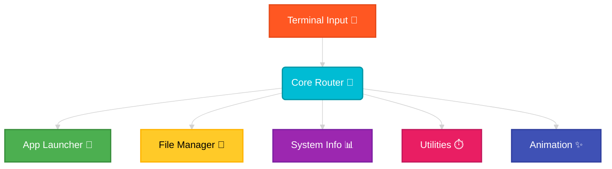

<div align="center">

# 🚀 Terminal Assistant 💻✨

### *Your personal, local command-line companion — cat-powered & color-charged!* 🐾


> *"You called? I heard keyboard clicks~ ♡"*
>
> — **Terminal Neko**, guarding your CLI since 2024 🌸

</div>

---

## 🌟 What is this?

Terminal Assistant is a **sleek, modular, Python-powered CLI assistant** that lives entirely on your computer!

> [!NOTE]
> 🐾 **No APIs. No internet. No drama.** Just pure, local cat-powered processing at your fingertips.



---

## 🛠️ Features

| ✨ Feature | 🐾 What it Does |
|---|---|
| 🚀 **App Launcher** | Instantly fire up Notepad, Calculator, Paint, Browser, and more! |
| 📁 **File Manager** | Create, delete, list, and recursively search files and folders |
| 📊 **System Info** | A colorful mini-Task Manager right in your terminal (CPU, Memory, Disk) |
| ⏱️ **Utilities** | Handy calculator + visual countdown timer! |
| 🕐 **Animated Clock** | A flashy digital clock for your command line! |

---

## 🚀 Full Setup Guide — Step by Step

<div align="center">


*The cat is ready. Are you?* 🐱
</div>

---

### 📋 Prerequisites

Before anything, make sure you have:

- ✅ **Python 3.8 or higher** — [Download here](https://www.python.org/downloads/) if you don't have it
- ✅ **pip** — comes bundled with Python
- ✅ **Git** — [Download here](https://git-scm.com/downloads/) if needed
- ✅ **Windows OS** — this assistant is built for Windows

To verify Python is installed, open any terminal and run:
```bash
python --version
```
You should see something like `Python 3.10.x`. If not, install Python first!

---

### 🐾 Step 1 — Clone the Repository

Open **Command Prompt** or **PowerShell** and run:

```bash
git clone https://github.com/kushalchalla981-tech/terminalAssistant.git
```

Then navigate into the project folder:

```bash
cd terminalAssistant
cd "term ass1"
```

> [!NOTE]
> The folder name has a space — make sure to wrap it in quotes!

---

### 🐾 Step 2 — Install Dependencies

The assistant uses `psutil` to read your system info. Install it with:

```bash
pip install -r requirements.txt
```

This installs everything in one shot. You should see a success message when it finishes.

> [!TIP]
> If `pip` doesn't work, try `pip3 install -r requirements.txt` instead.

---

### 🐾 Step 3 — Run the Assistant

```bash
python main.py
```

That's it! The Terminal Assistant will boot up and greet you 🎉

> [!TIP]
> If `python` doesn't work, try `python3 main.py` instead.

---

<div align="center">


**✅ Setup complete! The cat approves. Now go type some commands~**

</div>

---

## ⌨️ Command Cheat Sheet

Here's every trick up this assistant's sleeve (and paw 🐾):

| ${\color{lime}Task}$ | ${\color{cyan}Command\ Syntax}$ | ${\color{yellow}Example}$ |
| :--- | :--- | :--- |
| **Open Application** | `open <app_name>` | `open notepad` or `open browser` |
| **Create File** | `create file <n>` | `create file notes.txt` |
| **Create Folder** | `create folder <n>` | `create folder projects` |
| **Delete File** | `delete file <n>` | `delete file old_notes.txt` |
| **Delete Folder** | `delete folder <n>` | `delete folder old_projects` |
| **List Directory** | `list` | `list` |
| **Search File** | `search <filename>` | `search resume.pdf` |
| **System Info** | `sysinfo` | `sysinfo` |
| **Timer** | `timer <seconds>` | `timer 60` |
| **Calculator** | `calc <expression>` | `calc (10 + 5) * 2` |
| **Animated Clock** | `time` | `time` |
| **Clear Screen** | `clear` | `clear` |
| **Exit** | `exit` | `exit` |

---

## 🎨 Color Language

The assistant speaks in color so you always know what's happening:

> [!NOTE]
> 🟢 **Green** = Success — you did it!

> [!CAUTION]
> 🔴 **Red** = Error — something went wrong (the cat is concerned 🙀)

> [!TIP]
> 🔵 **Cyan & Yellow** = Info & highlights — pay attention here!

<div align="center">


*"I demand colorful terminal output at all times."*
</div>

---

## 🐾 Cat-Powered Status Guide

| ${\color{lime}Status}$ | ${\color{pink}Cat\ Mood}$ | ${\color{cyan}Meaning}$ |
|--------|----------|---------|
| ✅ `[OK]` | 😸 Joyful Neko | Everything worked perfectly! |
| ❌ `[ERROR]` | 🙀 Spooked Neko | Something went wrong |
| ⏳ `[WAIT]` | 😺 Patient Neko | Working on it... hold on~ |
| 💡 `[INFO]` | 🐱 Curious Neko | Here's something useful |
| 🚀 `[LAUNCH]` | 😼 Cool Neko | App is launching! |

---

## 🧠 Project Structure

```
terminalAssistant/
└── term ass1/
    ├── 📄 main.py              ← Entry point — start here!
    ├── 📋 requirements.txt     ← Dependencies (just psutil)
    ├── 📖 README.md            ← You are here 🐾
    └── 📦 commands/
        ├── 🚀 app_launcher.py  ← Launches your apps
        ├── 📁 file_manager.py  ← Manages files & folders
        ├── 📊 sys_info.py      ← Reads your system stats
        ├── ⏱️  utilities.py    ← Calculator & Timer
        └── ✨ animation.py     ← The digital clock magic
```

---

## 💡 Pro Tips

> [!TIP]
> 🐾 `sysinfo` is great for checking if your computer is overworked (like a cat with too many treats 🍪)

> [!TIP]
> 🐾 Use `timer 25` followed by `timer 5` for a classic Pomodoro session — productivity neko-style! 🍅

> [!TIP]
> 🐾 Type `clear` anytime to clean up your terminal — a tidy workspace is a happy workspace!

---

<div align="center">

*Made with* 🐾 *and Python — enjoy your Terminal Assistant!* 🎉✨

</div>
