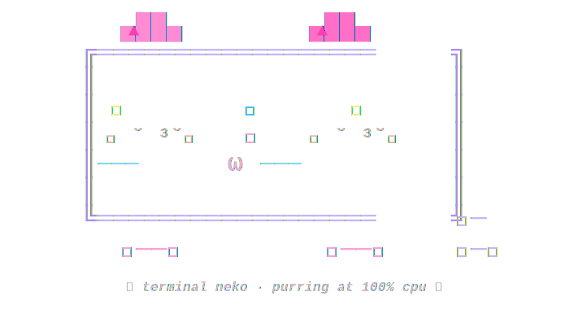
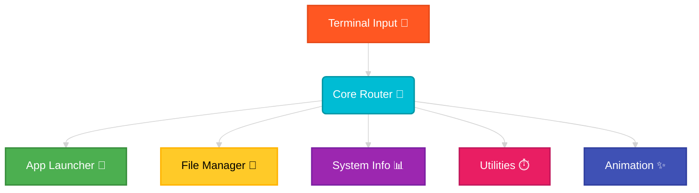

<div align="center">

# 🌸 Terminal Assistant 💻✨

### *Your local, cat-powered command-line companion!*


<br/>



> *"You called? I heard keyboard clicks~ ♡"*
> — **Terminal Neko**, guarding your CLI since 2024

</div>

---

## ${\color{violet}🌟\ What\ is\ this?}$

Terminal Assistant is a **sleek, modular, Python-powered CLI assistant** that lives entirely on your computer!

> [!NOTE]
> 🐾 **No APIs. No internet. No drama.** Pure, local cat-powered processing at your fingertips.



---

## ${\color{pink}🛠️\ Features}$

| ${\color{violet}✨\ Feature}$ | ${\color{cyan}🐾\ What\ it\ Does}$ |
|---|---|
| 🚀 **App Launcher** | Instantly fire up Notepad, Calculator, Paint, Browser, and more! |
| 📁 **File Manager** | Create, delete, list, and recursively search files and folders |
| 📊 **System Info** | A colorful mini-Task Manager right in your terminal (CPU, Memory, Disk) |
| ⏱️ **Utilities** | Handy calculator + visual countdown timer! |
| 🕐 **Animated Clock** | A flashy digital clock straight in your command line! |

---

## ${\color{lightblue}🚀\ Full\ Setup\ Guide}$

> [!TIP]
> Follow these steps in order and you'll be purring along in under 2 minutes! 🐱

---

### ${\color{yellow}📋\ Prerequisites}$

Make sure you have these before starting:

- ✅ **Python 3.8+** — [Download here](https://www.python.org/downloads/)
- ✅ **pip** — comes bundled with Python automatically
- ✅ **Git** — [Download here](https://git-scm.com/downloads/)
- ✅ **Windows OS** — this assistant is built for Windows

Verify Python is ready by opening any terminal and running:
```bash
python --version
# Should print something like: Python 3.10.x
```

---

### ${\color{lime}🐾\ Step\ 1\ —\ Clone\ the\ Repository}$

Open **Command Prompt** or **PowerShell** and run:
```bash
git clone https://github.com/kushalchalla981-tech/terminalAssistant.git
cd terminalAssistant
cd "term ass1"
```

> [!NOTE]
> The inner folder name has a space — the quotes are important!

---

### ${\color{lime}🐾\ Step\ 2\ —\ Install\ Dependencies}$

```bash
pip install -r requirements.txt
```

This installs `psutil` (used for reading system stats). Done in seconds!

> [!TIP]
> If `pip` doesn't work, try `pip3 install -r requirements.txt`

---

### ${\color{lime}🐾\ Step\ 3\ —\ Launch!}$

```bash
python main.py
```

The Terminal Assistant boots up and greets you. That's all there is to it! 🎉

> [!TIP]
> If `python` doesn't work, try `python3 main.py`

---

## ${\color{pink}⌨️\ Command\ Cheat\ Sheet}$

| ${\color{lime}Task}$ | ${\color{cyan}Command\ Syntax}$ | ${\color{yellow}Example}$ |
| :--- | :--- | :--- |
| **Open Application** | `open <app_name>` | `open notepad` / `open browser` |
| **Create File** | `create file <name>` | `create file notes.txt` |
| **Create Folder** | `create folder <name>` | `create folder projects` |
| **Delete File** | `delete file <name>` | `delete file old_notes.txt` |
| **Delete Folder** | `delete folder <name>` | `delete folder old_projects` |
| **List Directory** | `list` | `list` |
| **Search File** | `search <filename>` | `search resume.pdf` |
| **System Info** | `sysinfo` | `sysinfo` |
| **Timer** | `timer <seconds>` | `timer 60` |
| **Calculator** | `calc <expression>` | `calc (10 + 5) * 2` |
| **Animated Clock** | `time` | `time` |
| **Clear Screen** | `clear` | `clear` |
| **Exit** | `exit` | `exit` |

---

## ${\color{violet}🎨\ Color\ Language}$

> [!NOTE]
> 🟢 **Green** = Success — purrfect!

> [!CAUTION]
> 🔴 **Red** = Error — the cat is concerned 🙀

> [!TIP]
> 🔵 **Cyan & Yellow** = Info & highlights — eyes on this!

---

## ${\color{pink}🐾\ Cat-Powered\ Status\ Guide}$

| ${\color{lime}Status}$ | ${\color{pink}Cat\ Mood}$ | ${\color{cyan}Meaning}$ |
|---|---|---|
| ✅ `[OK]` | 😸 Joyful Neko | Everything worked perfectly! |
| ❌ `[ERROR]` | 🙀 Spooked Neko | Something went wrong |
| ⏳ `[WAIT]` | 😺 Patient Neko | Working on it... hold on~ |
| 💡 `[INFO]` | 🐱 Curious Neko | Here's something useful |
| 🚀 `[LAUNCH]` | 😼 Cool Neko | App is launching! |

---

## ${\color{lightblue}🧠\ Project\ Structure}$

```
terminalAssistant/
└── term ass1/
    ├── 📄 main.py              ← Entry point — start here!
    ├── 📋 requirements.txt     ← Dependencies (just psutil)
    ├── 📖 README.md            ← You are here 🐾
    ├── 🖼️  assets/             ← Neko lives here
    └── 📦 commands/
        ├── 🚀 app_launcher.py  ← Launches your apps
        ├── 📁 file_manager.py  ← Manages files & folders
        ├── 📊 sys_info.py      ← Reads your system stats
        ├── ⏱️  utilities.py    ← Calculator & Timer
        └── ✨ animation.py     ← The digital clock magic
```

---

## ${\color{yellow}💡\ Pro\ Tips}$

> [!TIP]
> 🐾 `sysinfo` is great for checking if your computer is overworked (like a cat with too many treats 🍪)

> [!TIP]
> 🐾 `timer 25` → `timer 5` → repeat! Classic Pomodoro, neko-style 🍅

> [!TIP]
> 🐾 `clear` anytime to tidy up — a clean terminal is a happy terminal!

---

<div align="center">

*Made with* 🐾 *and Python — enjoy your Terminal Assistant!* 🎉✨

</div>
